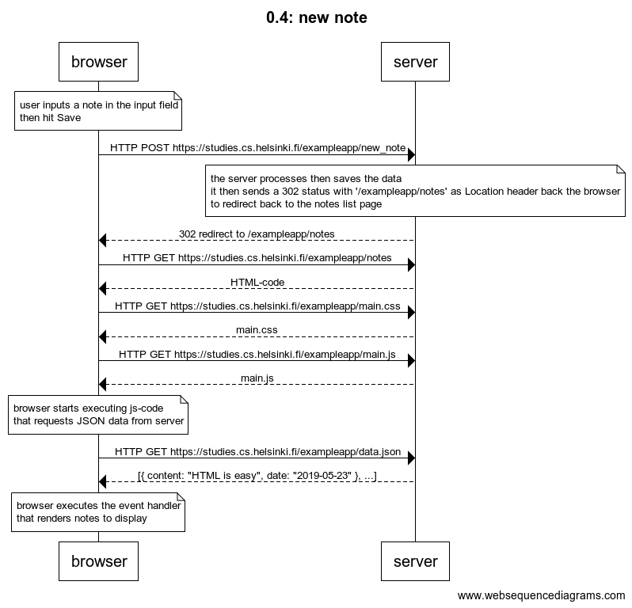
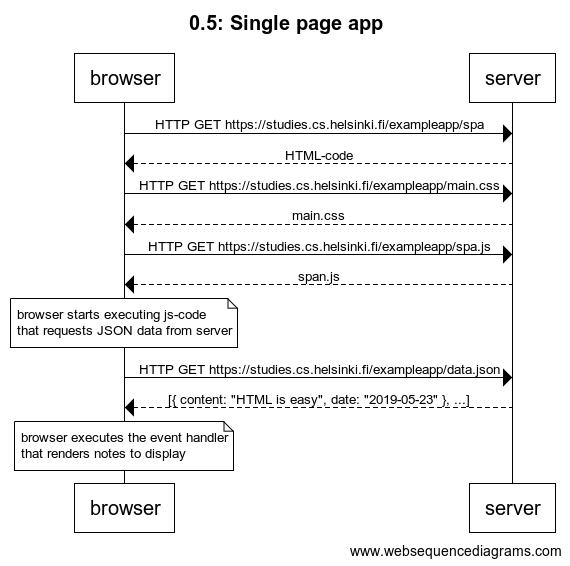
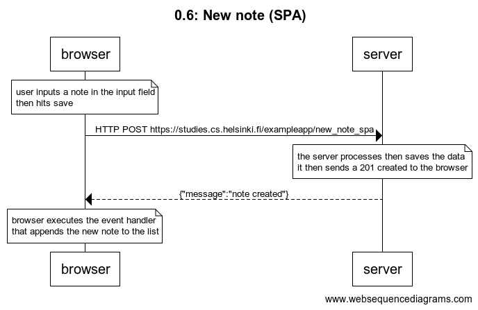

## 0.1: HTML
Review the basics of HTML by reading this tutorial from Mozilla: HTML tutorial.  


## 0.2: CSS
Review the basics of CSS by reading this tutorial from Mozilla: CSS tutorial.


## 0.3: HTML forms
Learn about the basics of HTML forms by reading Mozilla's tutorial Your first form.


## 0.4: new note
Create a similar diagram depicting the situation where the user creates a new note on page https://studies.cs.helsinki.fi/exampleapp/notes when writing something into the text field and clicking the submit button.

If necessary, show operations on the browser or on the server as comments on the diagram.

The diagram does not have to be a sequence diagram. Any sensible way of presenting the events is fine.

All necessary information for doing this, and the next two exercises, can be found from the text of this part. The idea of these exercises is to read the text through once more, and to think through what is going on there. Reading the application code is not necessary, but it is of course possible.

### Solution:


```
title 0.4: new note

note over browser:
user inputs a note in the input field
then hit Save
end note

browser->server: HTTP POST https://studies.cs.helsinki.fi/exampleapp/new_note

note over server:
the server processes then saves the data
it then sends a 302 status with '/exampleapp/notes' as Location header back the browser
to redirect back to the notes list page
end note

server-->browser: 302 redirect to /exampleapp/notes
browser->server: HTTP GET https://studies.cs.helsinki.fi/exampleapp/notes
server-->browser: HTML-code
browser->server: HTTP GET https://studies.cs.helsinki.fi/exampleapp/main.css
server-->browser: main.css
browser->server: HTTP GET https://studies.cs.helsinki.fi/exampleapp/main.js
server-->browser: main.js

note over browser:
browser starts executing js-code
that requests JSON data from server 
end note

browser->server: HTTP GET https://studies.cs.helsinki.fi/exampleapp/data.json
server-->browser: [{ content: "HTML is easy", date: "2019-05-23" }, ...]

note over browser:
browser executes the event handler
that renders notes to display
end note

```

## 0.5: Single page app
Create a diagram depicting the situation where the user goes to the single page app version of the notes app at https://studies.cs.helsinki.fi/exampleapp/spa.



```
title 0.5: Single page app

browser->server: HTTP GET https://studies.cs.helsinki.fi/exampleapp/spa
server-->browser: HTML-code
browser->server: HTTP GET https://studies.cs.helsinki.fi/exampleapp/main.css
server-->browser: main.css
browser->server: HTTP GET https://studies.cs.helsinki.fi/exampleapp/spa.js
server-->browser: span.js

note over browser:
browser starts executing js-code
that requests JSON data from server 
end note

browser->server: HTTP GET https://studies.cs.helsinki.fi/exampleapp/data.json
server-->browser: [{ content: "HTML is easy", date: "2019-05-23" }, ...]

note over browser:
browser executes the event handler
that renders notes to display
end note
```

## 0.6: New note
Create a diagram depicting the situation where the user creates a new note using the single page version of the app. 


```
title 0.6: New note (SPA)

note over browser:
user inputs a note in the input field
then hits save
end note

browser->server: HTTP POST https://studies.cs.helsinki.fi/exampleapp/new_note_spa

note over server:
the server processes then saves the data
it then sends a 201 created to the browser
end note

server-->browser: {"message":"note created"}

note over browser:
browser executes the event handler
that appends the new note to the list
end note
```